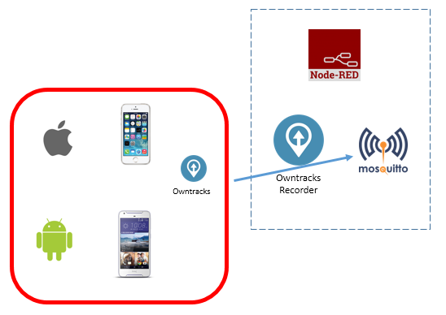

# Wow...
Getting (young) people interested to pursue a career in open source is not always easy. They are surrounded by it but do not recognise it as such.
Wether is it their smartphone (Android is Linux based, iOS is BSD Unix based), or an appliance at home, they are surrounded by it.

Facebook, Google and others are simply 'always on' services somewhere in the cloud. What's inside the cloud is often not known.

If you tell them that the majority of the appliances, smartphones or cloud solutions are Linux based you might get their interest.

And you might lose it just as quick if you start teaching Linux in a very abstract manner.

# Getting them to say wow...
Often when I'm asked to inspire young people I tend to do two things:
1. Have them participate in a open source environment that mimics cloud solutions and technologies, but then in a small scale.
2. Show them the power by explaining to them how FlightRadar 24 operates and how they can be part of the community.

# Network connectivity
In order to be succesful with the wow factor your system has to be connected to a network that can be reached from the smartphones. Often this will be the WiFi network. Please write the IP address down, the students will need it to connect to the MQTT broker.

## Part 1
This requires a bit of planning but won't take much longer than 10 to 15 minutes once you start.

The objective is to create an environment which is similar to the following illustration: 
On the left there are smartphones running the application 'Owntracks'. This application is available for free in Google Play and the Apple Appstore.

Students will have to download this application and configure it. If done properly their phone will transmit location information to a MQTT broker. Mosquitto is such a broker.
The location information is also shared with the other students if the MQTT broker lacks the proper security settings, which it does by default.

Suddenly the students realise why we need focus on privacy and security.

The second step is to introduce Node RED. This can be run on virtually any system: macOS, Windows, Linux, Raspberry Pi....
It is a graphical environment that make it easy to display the reported locations by just connecting three 'nodes'...

Node RED and Mosquitto can be running on the same system, but if they run on different systems it is more visual how devices can share information with cloud based services and vice versa.

## Option 1, with Docker
For this setup we will use a Raspberry Pi and install Docker first. Once Docker is up and running we will start a couple of containers: One for Mosquitto and one for Node RED. You can also use any other system that is capable of running Docker containers to host the services.

The instructions to install Docker can be found here: https://docs.docker.com/install/linux/docker-ce/debian/
Make sure to reboot the Pi afterwards.

In brief the installation steps are repeated below:

* Login as the user pi on a Raspberry Pi. 
* Open a terminal session and type the following commands:

```bash
curl -fsSL https://get.docker.com -o get-docker.sh
sudo sh get-docker.sh
```
* Wait for it to complete and then add the user pi to the docker group:
```
sudo usermod -aG docker pi
```
Be carefull, this gives the user pi full control over the host system! On a Raspberry Pi the user pi has the ability to use `sudo` anyway, but on many production systems you might skip this step.

## Option 2, bare metal installation
The software installation can be done 'old school' as well. It's simply typing a couple of commands and waiting for them to complete.

Enter the following commands to get everything up and running:

```bash
sudo apt update
sudo apt install -y mosquitto mosquitto-clients nodered npm

cd ~/.node-red
npm install node-red-contrib-web-worldmap
npm install node-red-contrib-owntracks

sudo systemctl enable --now nodered
```

Enter the following URL on any workstation that is able to connect with the system running Node RED and enter the following URL:
`http:<ip of node-red>:1880` and press enter.


Select and copy the JSON formatted text below with your mouse. 

```json
[
    {
        "id": "10016e5.15bdc12",
        "type": "mqtt in",
        "z": "712b7a52.56bd7c",
        "name": "",
        "topic": "owntracks/#",
        "qos": "0",
        "broker": "5df56435.f281ec",
        "x": 171.5,
        "y": 214,
        "wires": [
            [
                "203498bc.ca3be8"
            ]
        ]
    },
    {
        "id": "203498bc.ca3be8",
        "type": "owntracks",
        "z": "712b7a52.56bd7c",
        "x": 394.5,
        "y": 213,
        "wires": [
            [
                "58e95381.8ed814"
            ]
        ]
    },
    {
        "id": "58e95381.8ed814",
        "type": "worldmap",
        "z": "712b7a52.56bd7c",
        "name": "",
        "lat": "",
        "lon": "",
        "zoom": "",
        "layer": "",
        "cluster": "",
        "maxage": "",
        "usermenu": "show",
        "layers": "show",
        "panit": "false",
        "panlock": "false",
        "zoomlock": "false",
        "hiderightclick": "false",
        "coords": "false",
        "path": "/worldmap",
        "x": 611.5,
        "y": 213,
        "wires": []
    },
    {
        "id": "5df56435.f281ec",
        "type": "mqtt-broker",
        "z": "",
        "name": "",
        "broker": "localhost",
        "port": "1883",
        "clientid": "",
        "usetls": false,
        "compatmode": true,
        "keepalive": "60",
        "cleansession": true,
        "birthTopic": "",
        "birthQos": "0",
        "birthRetain": "false",
        "birthPayload": "",
        "closeTopic": "",
        "closeQos": "0",
        "closeRetain": "false",
        "closePayload": "",
        "willTopic": "",
        "willQos": "0",
        "willRetain": "false",
        "willPayload": ""
    }
]
```
